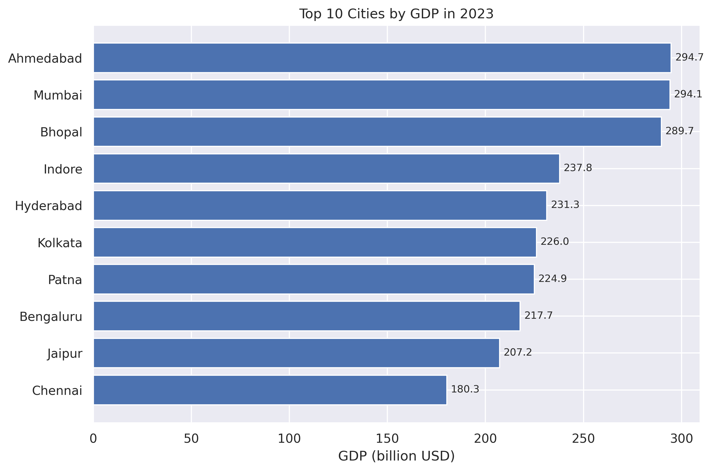
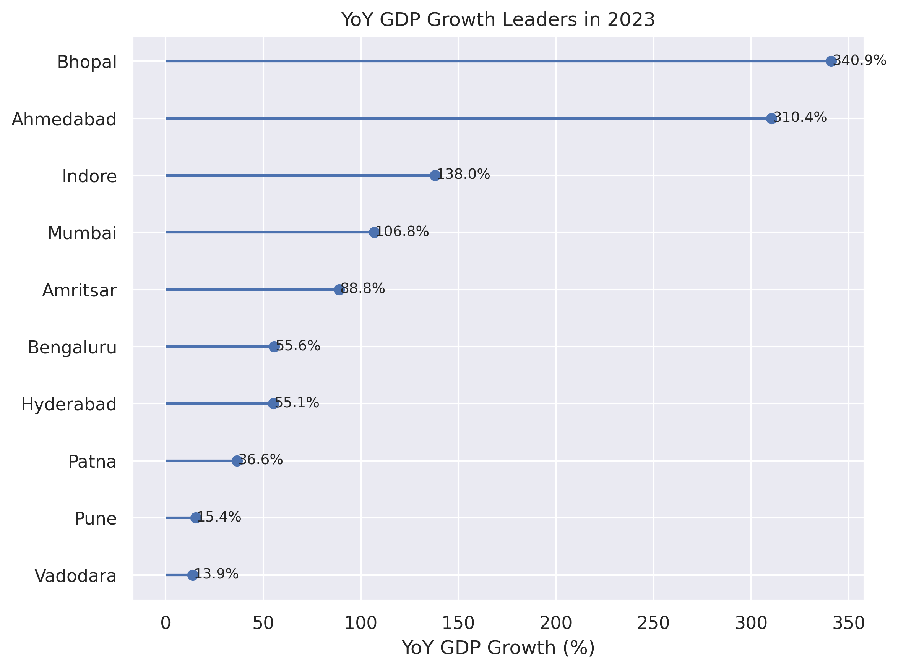
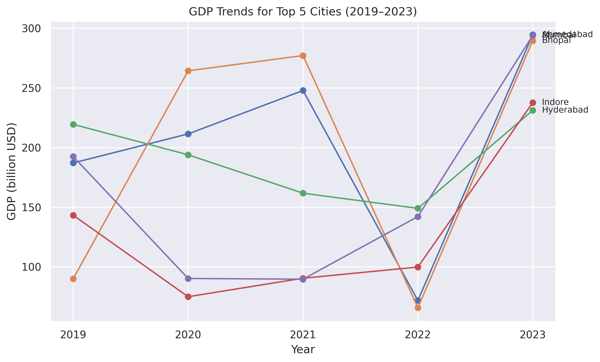
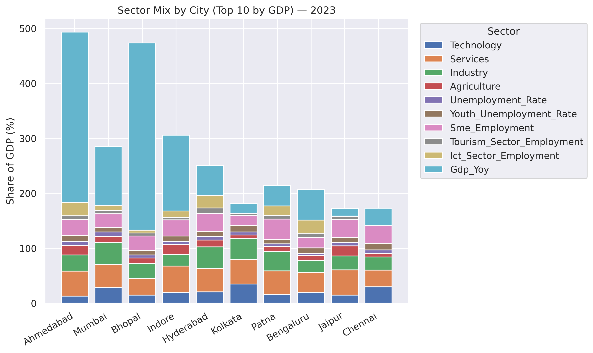

# indian-cities-gdp-2019-2024
EDA of GDP &amp; productivity across Indian cities (2019–2024): cleaning, trends, visuals, insights.

## Results (selected)

**Top 10 cities by GDP (latest year)**

**YoY GDP growth leaders**

**GDP trends for top 5 cities**

**Sector mix (top 10 by GDP)**

## Data Artifacts
- Cleaned master dataset: `data/cleaned/indian_cities_gdp_productivity.csv`
- EDA highlights table: `reports/top_cities_highlights.csv`
